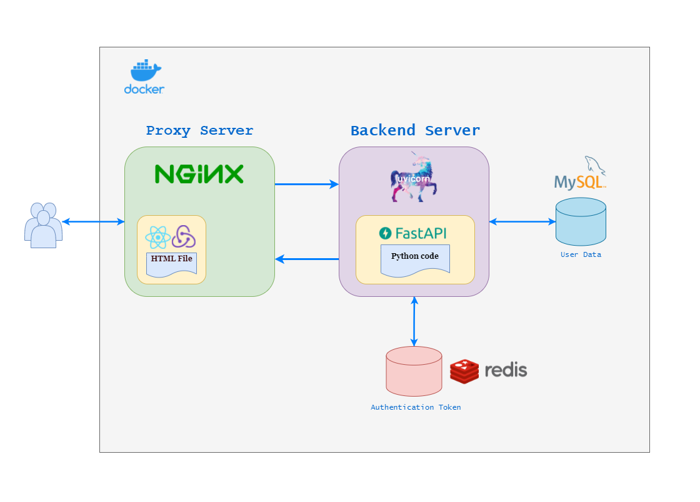
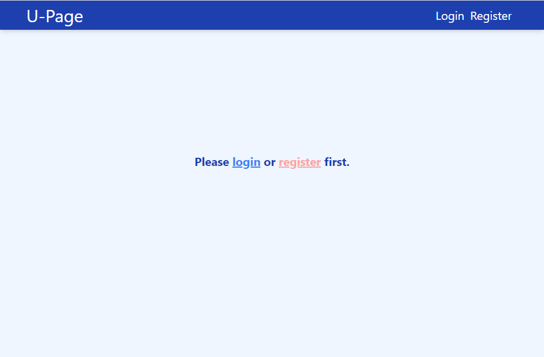
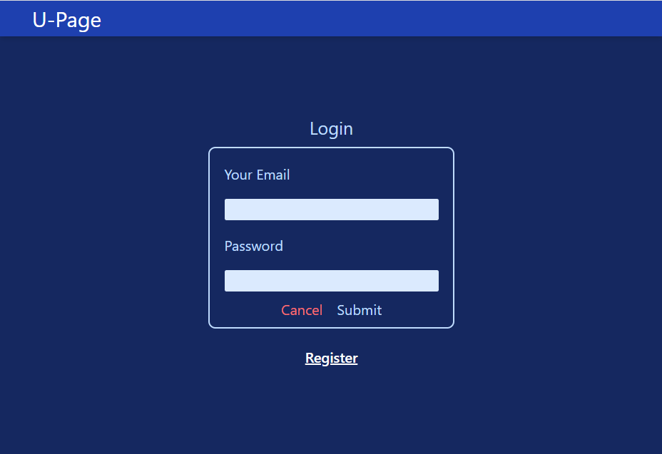
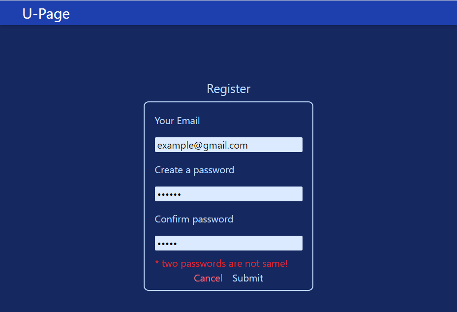
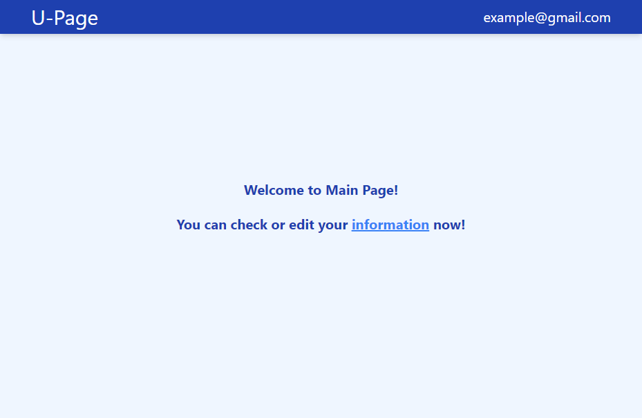
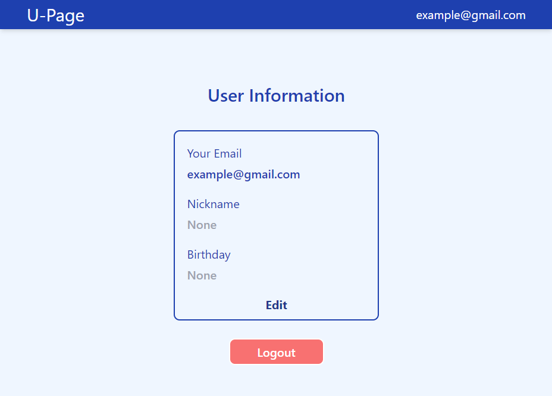
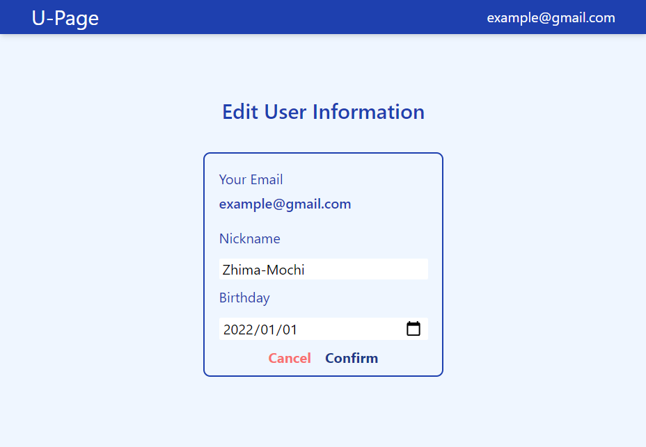
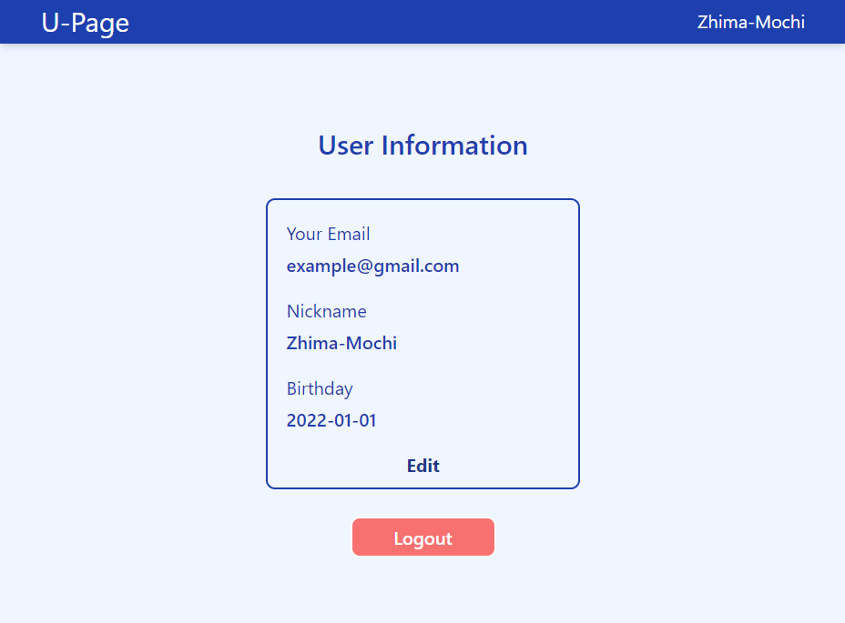
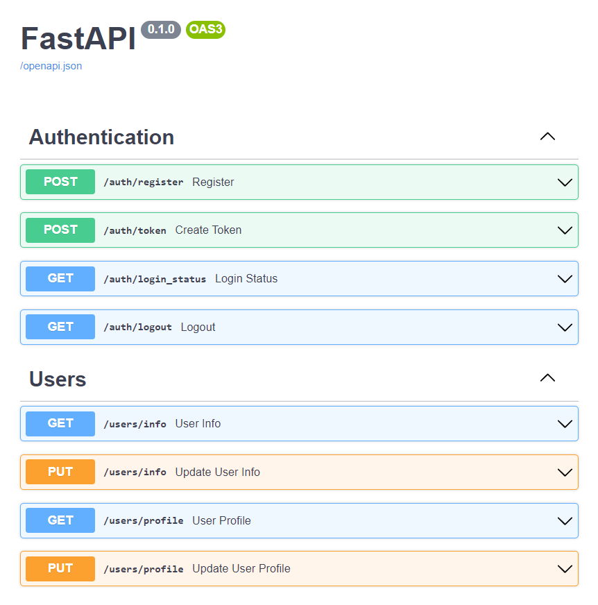

# LOGIN WEBSITE

## Overview
This application offer function of user authentication, when users register and login, they can edit their information until they logout or json web token is expired.

## Architecture



## Technology Stack
### Infrastructure
* MySQL
* Redis
* Nginx
* ASGI
* Docker
* Json Web Tokens (JWT) Authentication
* CSRF protection

### Backend RESTful API
* FastAPI
* SQLAlchemy ORM
* Databases Asynchronous I/O

### Frontend Webpage
* Creat React App
* Redux
* Tailwind CSS

## Getting started
```sh
docker-compose up
```

## Demo







